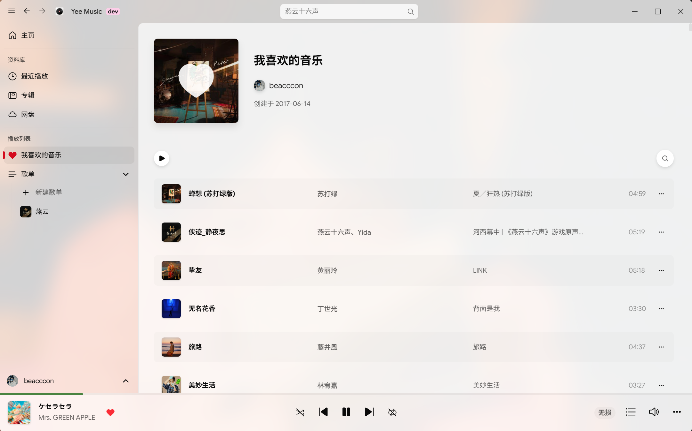
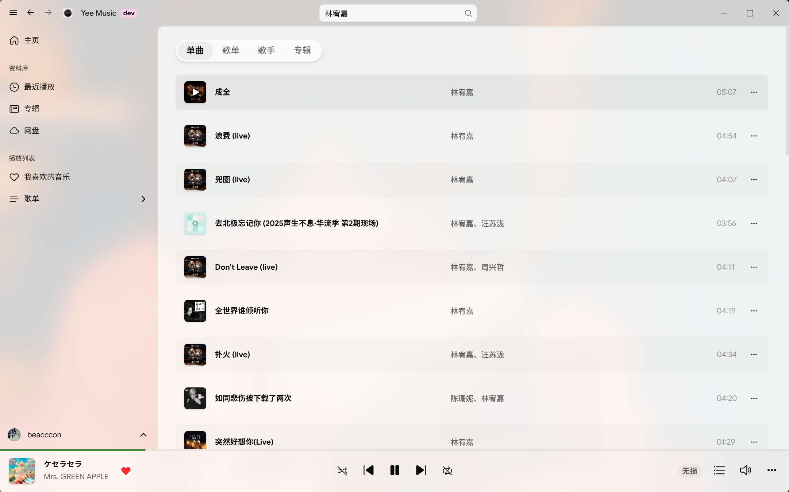
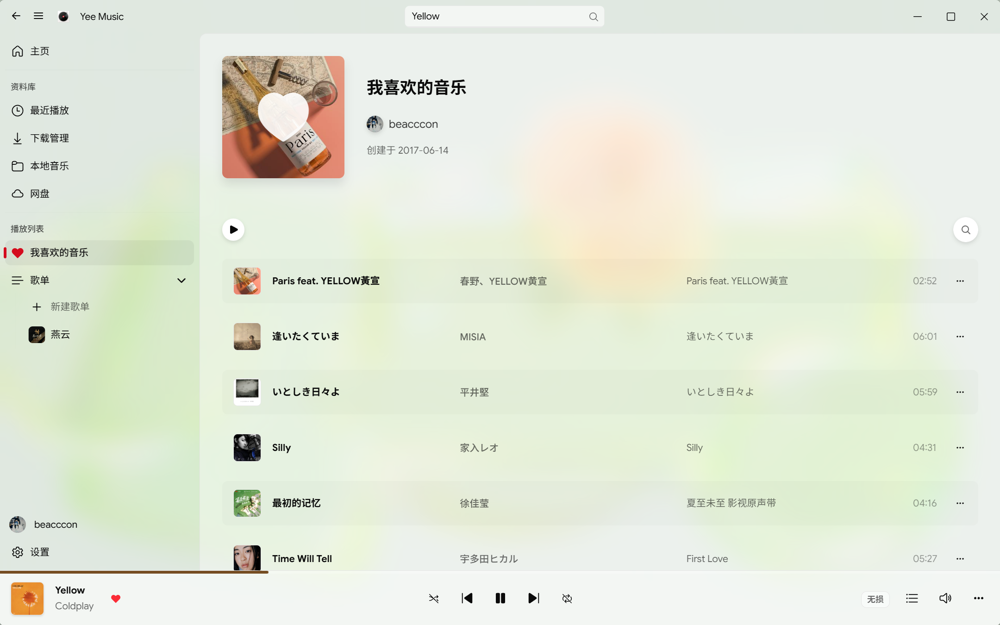
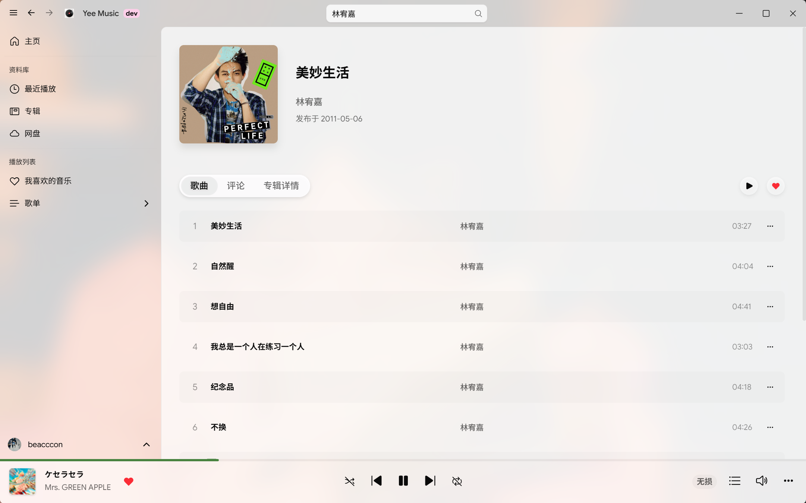
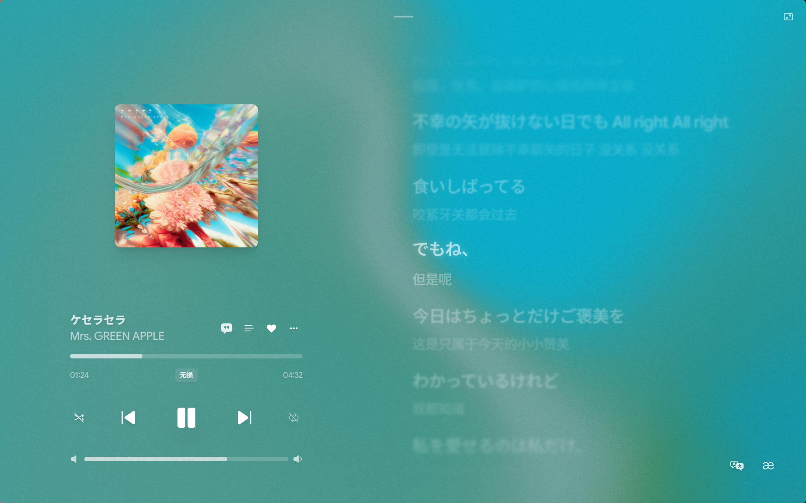

<div align="center">
  <h1>Yee Music</h1>

  
</div>

<div align="center">
  <p>简洁美观的第三方网易云音乐客户端</p>
  <p><strong>优雅、灵动</strong></p>
</div>

<div align="center">
    <a href="https://github.com/1sen3/YeeMusic/releases">
        
      </a>
  
  
  <a href="https://opensource.org/licenses/MIT">
    
  </a>
</div>

## 🖼️ 界面展示

<div style="display: flex; flex-wrap: wrap; gap: 10px;">
  
  
  
  
  
  
</div>
    
## ✨ 功能与特性

- 界面设计深度参考 Fluent UI 设计规范
- 支持 Win11 原生 Acrylic 与 Mica 效果
- 扫码登录及手机号登录
- 深浅色主题
- 新建、编辑、删除歌单及对歌单添加\删除歌曲
- 逐字歌词以及基于 Framer Motion 实现的类 Apple Music 风格歌词滚动动画
- 支持调节流体渐变背景的变形强度与漩涡效果
- 支持全局界面与独立歌词字体配置
- 集成歌词翻译以及罗马音歌词

## 📅 更新计划

- [ ] 歌曲下载管理
- [ ] 音乐网盘
- [ ] 歌曲评论区
- [ ] 本地音乐播放支持
- [ ] 桌面歌词

## 🚀 快速开始

在开始之前，请确保你的开发环境已安装 [Rust](https://www.rust-lang.org/tools/install) 和 [Node.js](https://nodejs.org/)。

### 1. 环境要求

- **Node.js**: >= 20
- **Rust**
- **Windows 依赖**: 确保已安装 C++ 生成工具和 Edge WebView2 运行时

### 2. 安装运行

``` bash
# 1. 克隆项目
git clone https://github.com/1sen3/YeeMusic.git
cd yee-music

# 2. 安装依赖
pnpm install

# 3. 启动开发环境
pnpm tdev

# 4. 构建
pnpm tbuild
```

## ⚙️ 自定义 API 配置

本项目不直接提供后端服务，如有需要请自行部署 [NeteaseCloudMusicAPI Enhanced](https://github.com/neteasecloudmusicapienhanced/api-enhanced)。

1. 部署好 API 服务后，获取你的服务地址。
2. 在项目根目录下的 src/lib/utils/api.ts 中，修改 BASE_URL 变量：

``` ts
// src/lib/utils/api.ts
const BASE_URL = "你的 API 地址";
```

## 🛠️ 技术栈

- **核心**: React 19, TypeScript, Rust, Tauri 2.0
- **动画**: Framer Motion, GSAP, Three.js
- **样式**: TailwindCSS 4.0, shadcn/ui, Fluent UI React
- **状态与数据**: Zustand, SWR
- **工具链**: Biome, Vitest

## 🎁 致谢

- [tauri](https://github.com/tauri-apps/tauri)
- [NeteaseCloudMusicAPIEnhanced](https://github.com/neteasecloudmusicapienhanced/api-enhanced)
- [Howler.js](https://github.com/goldfire/howler.js)
- [shadcn/ui](https://github.com/shadcn-ui/ui)
- [Zustand](https://github.com/pmndrs/zustand)
- [Fluent UI](https://github.com/microsoft/fluentui)
- [shaders](https://github.com/paper-design/shaders)

## ⚠️ 声明

- 本项目为本人学习用的开源项目，仅供学习交流使用。
- 项目中使用的音乐数据及 API 均来自第三方，版权归属于网易云音乐，**请勿用于任何商业用途**。

## 📄 开源协议

本项目基于 [MIT License](./LICENSE) 协议开源

- 你可以自由地使用、复制、修改和分发本项目的代码。
- 请在使用时保留原作者的版权声明和许可声明。
